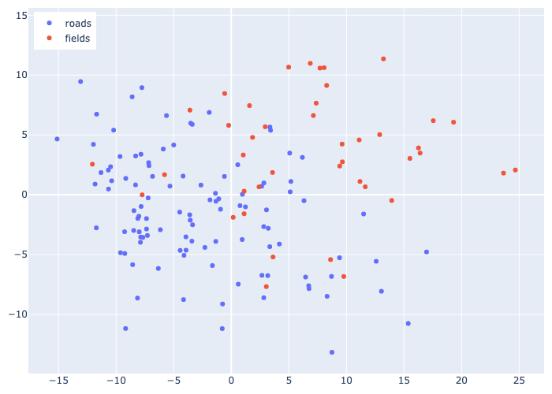
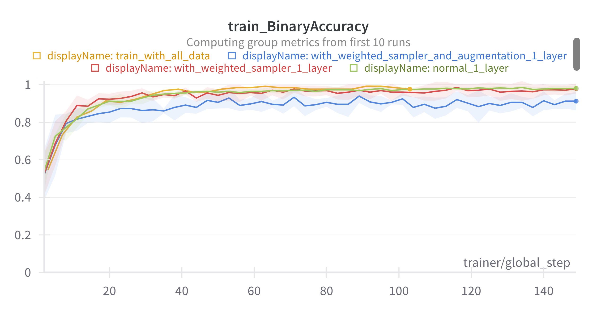
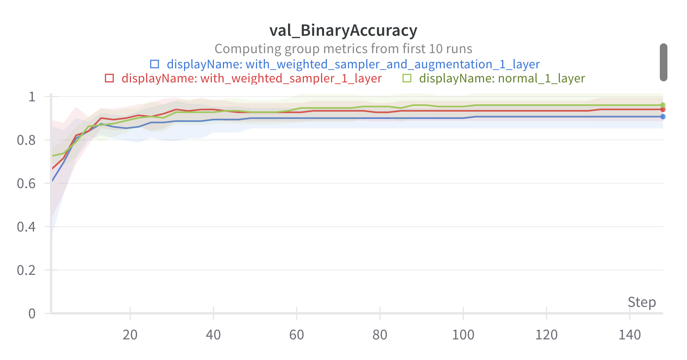

# Introduction
This repository contains the solution for technical exercise for AI Engineer position at Trimble / Bilberry.
Your goal is to create a two class classifier : **Field** & **Road** using the available data [here](https://drive.google.com/file/d/1pOKhKzIs6-oXv3SlKrzs0ItHI34adJsT/view?usp=sharing).


Instrunctions to run the code are given in [INSTALL.md](INSTALL.md) file.


# Directory structure
```
├── dataset/                        # train and test images
│   ├── test_images/
│   └── train/
├── plots/                          # plots for experiments
├── requirements/                   # dependencies to install
├── src/                            # source files
│   ├── data_preprocessing/         # dataset / datamodule creation
│   ├── model/                      # model creation, training, evaluation
│   ├── utils/                      # helper functions
│   ├── __init__.py
│   ├── setup.py                    # get the dataset, create the PCA plots
├── INSTALL.md
├── README.md
```

# Solution
## Analysis

Overall, the training dataset has `153` images of 2 classes:
* `Fields`: 45 images, which corresponds to `29.4%` of the dataset
* `Roads`: 108 images, which corresponds to `70.6%` of the dataset

<div style="display: flex;">
  
  
</div>
<br>

Insights:
<ol>
  <li>The training dataset is quite small, then when training a deep neural network, it should be better to freeze the weights of the model and only train the head of the model to avoid overfitting.</li>
  <li>There is no validation dataset, then we can use cross-validation to evaluate the model.</li>
  <li>The dataset is imbalanced; therefore, during training, images pertaining to the Field class should be sampled more frequently to achieve a balance between the two classes.</li>
</ol>

For 2D image classification problem, general approach is to use a pre-trained CNN model as backbone, add a classifier head on top of it and fine-tune the model on the target dataset. This is useful because the pre-trained model can extract meaningful features from images as it has been trained on a large dataset. However, as we have a small training dataset, it is better to freeze the weights of the backbone and only train the classifier head.

To test the hypothesis that pre-trained model are good at extract meaningful features, we can attempt to extract embedding vectors of all training images, and plot them in a 2D space using PCA. We expect that images of the same class will be clustered together (the visualization may not be perfect due to the loss of information resulting from reducing the embedding to a 2D space). The backbone used for experiments is [ConvNeXt](https://huggingface.co/timm/convnextv2_tiny.fcmae), a state-of-the-art CNN model on ImageNet dataset.
The plots are show below (for interactive plots, please open [this file](plots/train_embeddings.html)):

<div style="display: flex;">
  
  
</div>

The plots on 2D space are quite good. However, there are some datapoints of `Field` that have strong signal for `Road` class. By checking several images, we can see that there are some images of `Field` that have a `Road` in the background, e.g [image 3](plots/3.jpg) and [image 5](plots/5.jpg) that are circled by black contour. Therefore, we can remove these images from the training dataset. These 2 images are manually removed from the training dataset.


## Dataset splitting
<ol>
<li>As the size of the training dataset is small, then it's hard to properly split the dataset into train/validation/test sets. Therefore, we can use cross-validation to evaluate the model. The dataset is splitted with StratifiedKFold to preserve the class distribution in each fold.</li>
<li>As the training dataset is imbalance, during training, samples of minor class will be sampled more frequent.</li>
</ol>

## Training with Support Vector Classification
The first approach is to use Support Vector Classification (SVC) with features extracted from [ConvNeXt](https://huggingface.co/timm/convnextv2_tiny.fcmae). The model is trained with 5-fold cross-validation, with different settings by GridSearchCV. The best model is selected based on the average f1-score of 5 folds. The best model is then trained on the whole training dataset and evaluated on the test dataset.

The configuration are shown below:

```python
param_grid = [
        {"C": [0.1, 1, 10, 100, 1000], "kernel": ["linear"]},
        {
            "C": [0.1, 1, 10, 100, 1000],
            "gamma": [0.001, 0.01, 0.1, 1],
            "kernel": ["rbf", "sigmoid"],
        },
        {
            "C": [0.1, 1, 10, 100, 1000],
            "degree": [2, 3, 5, 7, 10],
            "gamma": [0.001, 0.01, 0.1, 1],
            "kernel": ["poly"],
        },
    ]
```

The configuration and results for the best model are shown below:
```yaml
C: 0.1
degree: 3
gamma: 0.01
kernel: poly
```


The predictions of the best model on test dataset are shown below:


## Training with pre-trained ConvNeXt
We use [ConvNeXt](https://huggingface.co/timm/convnextv2_tiny.fcmae), a state-of-the-art CNN model on ImageNet dataset, as backbone. We add a classifier head with 2 outputs nodes represent for 2 classes `Field` and `Road` on top of the backbone. As mentioned before that the training dataset is quite small and imbalanced then:
<ol>
  <li>We can freeze the backbone and only train the classifier head.</li>
  <li>Images pertaining to the Field class should be sampled more frequently with WeightedRandomSampler to achieve a balance between the two classes.</li>
  <li>The model is trained with 5-fold cross-validation (splitted with StratifiedKFold) for each combination of hyper-parameter. The best model is selected based on the average f1-score of 5 folds.</li>
</ol>

The results of 3 different hyper-parameter combinations are shown below (NB: We only use 1 output layer for the classifier head and we do not use any hidden layer):
<ol>
  <li>The <span style="color:green"><strong>Green</strong></span> line means we do normal supsampling with imbalanced data in the train-dataloader.</li>
  <li>The <span style="color:red"><strong>Red</strong></span> line means we use WeightedRandomSampler to sample more frequently for minor class i.e Field in our case.</li>
  <li>The <span style="color:blue"><strong>Blue</strong></span> line means we use WeightedRandomSampler to sample more frequently for minor class i.e Field in our case and also apply data augmentations to avoid training on the same images multiple time.</li>
</ol>

|  |  |  |
| :---: | :---: | :---: |
|  |  |  |

We can see that the <span style="color:green"><strong>Green</strong></span> line performs better than <span style="color:red"><strong>Red</strong></span> and the <span style="color:blue"><strong>Blue</strong></span> lines. One reason can be that WeightedRandomSampler can sample some specific images multiple times than others, that can lead the model bias toward wrong direction. Other reason can be that the data augmentation is not strong enough to make the model generalize better.

We then train the model on the whole training dataset with the best configuration (configuration of the <span style="color:green"><strong>Green</strong></span> line) and evaluate on the test dataset. The complete configuration is shown below:

```yaml
model:
  backbone: "convnextv2_tiny.fcmae"
  hidden_units: 0
  num_classes: 2
  freeze_backbone: true

data:
  root_dir: "dataset/train"
  nb_folds: 5
  batch_size: 32
  augmentation: false
  # as training data is imbalanced, we can use weighted sampler
  weighted_sampler: false
  test_dir: "dataset/test_images"

training:
  learning_rate: 1e-3
  lr_monitor: "train_loss"
  weight_decay: 1e-3
  nb_epochs: 40
  lr_decay_patience: 2
  lr_decay_threshold: 0.01
```

The predictions of the best model on test dataset are shown below:


We notice that the [image 4](dataset/test_images/4.jpeg) and [image 7](dataset/test_images/7.jpeg) are misclassified, while they are correctly classified by the SVC model. Some possible reasons are 
<ol>
  <li>Our CNN classifier head contain only one linear layer, which might not be enough to learn the complex features of the images, whereas in SVC, the polynomial kernel at degree 3 is used, which is more complex than a linear layer and make it possible to correctly classify these images.</li>
  <li>The CNN could potentially acquire knowledge about sky features more effectively, given that road images tend to include the sky more frequently than field images. Additionally, the dataset comprises a larger number of road images compared to field images.</li>
</ol>

For future work, we can try to add more hidden layers before the classifier head to see if it works better.

## Conclusion
<ol>
  <li>The dataset is small then training a Deep Neural is impossible (model will overfit for just several epochs), except freezing the backbone and train for few parameters for the head classifier.</li>
  <li>Data imbalanced can lead to unstable training for Deep Neural Network</li>
  <li>SVC performs effectively, utilizing a Polynomial kernel that is more intricate than a linear layer in our CNN context. The SVC endeavors to identify a plane that efficiently separates the classes of Field and Road, maximizing the margin/distance to these two categories.</li>
  <li>The CNN performs less effective than SVC as it use only 1 linear layer for the classifier head. The data imbalanced can also affect the training process.</li>
</ol>


## Future work/TODO
For future work, we can try to:
- [ ] Acquire more data when training with deep neural network
- [ ] Test with a more complex classifier head for CNN (add some hidden layers before 2-class fully connected layer)
- [ ] Test Vision-Language model e.g CLIP for zero-shot learning
- [ ] Compare CNN features vs CLIP's image encoder features
